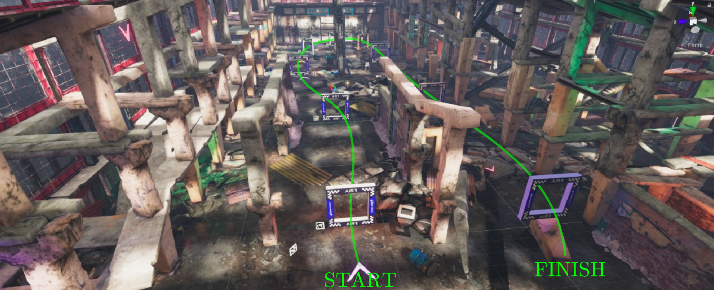

# FlightGoggles

This repository contains a mod of FlightGoggles simulator that builds a new race circuit with AIRR Gates.



## Installation
Installing FlightGoggles Simulation Framework on Local Machine
```sh
# Setup catkin workspace
mkdir -p ~/catkin_ws/src
cd ~/catkin_ws/
catkin init
# Add workspace to bashrc.
echo 'source ~/catkin_ws/devel/setup.bash' >> ~/.bashrc
cd src
wstool init
# Install FlightGoggles nodes and deps from rosinstall file
wstool merge https://raw.githubusercontent.com/xquadufmg/FlightGoggles/master/flightgoggles.rosinstall
wstool update
cd ../
# Install required libraries.
rosdep install --from-paths src --ignore-src --rosdistro kinetic -y
# Install external libraries for flightgoggles_ros_bridge
sudo apt install -y libzmqpp-dev libeigen3-dev
# Install dependencies for flightgoggles renderer
sudo apt install -y libvulkan1 vulkan-utils gdb
# Build nodes and download FlightGoggles renderer binary
# NOTE: to avoid downloading the FlightGoggles renderer binary, use the following build command:
catkin build --cmake-args -DFLIGHTGOGGLES_DOWNLOAD_BINARY=ON
# Refresh workspace
source ~/.bashrc
```

**Note**: For AMD GPUs, mesa-vulkan-drivers might also need to be installed. This package should not be needed for usage on NVidia GPUs.

In case you want to **run the FlightGoggles Simulation Framework on AWS** or any Headless Linux Server, follow [this steps](https://github.com/mit-fast/FlightGoggles/wiki/Running-Flightgoggles-in-AWS).


## Running FlightGoggles
```sh
# In terminal 2, you can run and exit various launch files with the use_external_renderer flag.
# To run example environment with joystick/keyboard teleoperation
roslaunch flightgoggles teleopExample.launch use_external_renderer:=1
# To run core simulation framework without teleoperation
roslaunch flightgoggles core.launch use_external_renderer:=1
```

Users may also run any of three different challenges by running:
```sh
roslaunch flightgoggles reporter.launch level:=easy
roslaunch flightgoggles reporter.launch level:=medium
roslaunch flightgoggles reporter.launch level:=hard
```

The challenges are completed if the drone passes through each of the gates that are part of the challenge in order.

These launch files run a reporter node in addition to the rest of the software that reports when the drone crosses the challenge gates and the overall time it took.

Feel free to edit the yaml files on flightgoggles/config/challenges to setup your own challenges.
